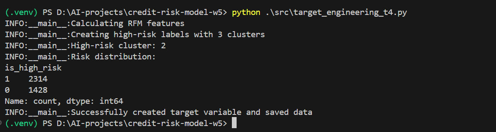
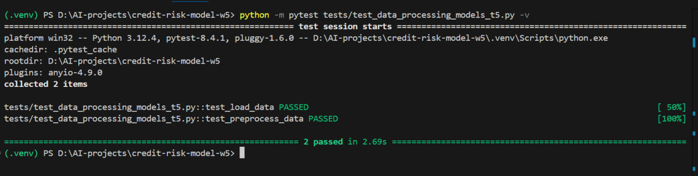

# Credit Risk Probability Model for Alternative Data

# Credit Scoring Business Understanding

## 1. Basel II Accord’s Impact on Model Requirements

The **Basel II Capital Accord** mandates that financial institutions maintain **risk-sensitive capital reserves** based on their credit exposure. This directly affects our model development in two key ways:

- **Transparency & Explainability**: Regulators require clear documentation of risk assessment models to ensure compliance with capital adequacy rules.
- **Risk Quantification**: The model must reliably distinguish between high-risk and low-risk borrowers to avoid under/overestimating capital requirements.

The **Basel II Capital Accord**fundamentally reshapes how financial institutions approach credit risk by introducing three key pillars:

1. **Minimum Capital Requirements**:

   - Mandates banks to hold capital proportional to their risk exposure
   - Requires rigorous quantification of credit risk probabilities
   - Our model must directly support capital adequacy calculations

2. **Supervisory Review Process**:

   - Regulators demand full transparency in risk assessment methodologies
   - Model documentation must explain all assumptions and decision points
   - Requires clear audit trails for all risk classifications

3. **Market Discipline**:
   - Stakeholders need to understand risk assessment logic
   - Model outputs must be explainable to both technical and non-technical audiences

**Implementation Implications**:

- We must prioritize model interpretability over pure predictive power
- All feature engineering decisions require business justification
- Documentation must cover the entire model lifecycle from development to deployment

**Why does this matter for our project?**  
Since Bati Bank must comply with Basel II, our credit risk model must:  
✔ Be **interpretable** (decision logic should be auditable).  
✔ Have **well-documented assumptions** (e.g., how alternative data maps to default risk).  
✔ Avoid **black-box approaches** unless rigorously validated.

---

## 2. The Need for a Proxy Variable & Associated Risks

### **Why a Proxy?**

The eCommerce dataset lacks a direct **"default" label** (unlike traditional banking data). Thus, we must engineer a **proxy variable** using:

- **RFM (Recency, Frequency, Monetary) patterns** – e.g., late payments, order cancellations, high refund rates.
- **Behavioral signals** – e.g., frequent cart abandonment, irregular purchase cycles.
  Our eCommerce context lacks these, requiring innovative alternatives:

**Proxy Construction Approach**:

1. **Behavioral Indicators**:

   - Purchase frequency patterns
   - Cart abandonment rates
   - Return/refund behaviors

2. **Financial Signals**:

   - Order value consistency
   - Payment method trends
   - Discount sensitivity

3. **Engagement Metrics**:
   - Account tenure
   - Customer service interactions
   - Review patterns

### **Business Risks of Using a Proxy**

⚠ **Misaligned Risk Prediction** – If the proxy poorly correlates with actual credit risk, the model may:

- Approve risky customers → Higher defaults.
- Reject creditworthy users → Lost revenue.

⚠ **Regulatory Challenges** – If auditors question the proxy’s validity, the bank could face compliance penalties.

**Mitigation Strategy:**

- Validate the proxy against historical bad debt trends (if available).
- Use **domain expert judgment** to refine risk thresholds.

---

## 3. Model Selection: Simplicity vs. Performance

### **Trade-offs in a Regulated Financial Context**

| **Model Type**                               | **Advantages**                                                                              | **Disadvantages**                                                                 |
| -------------------------------------------- | ------------------------------------------------------------------------------------------- | --------------------------------------------------------------------------------- |
| **Logistic Regression (Weight of Evidence)** | ✅ Easily interpretable<br>✅ Regulator-friendly<br>✅ Handles categorical data well        | ❌ Limited to linear relationships<br>❌ May underfit complex patterns            |
| **Gradient Boosting (XGBoost, LightGBM)**    | ✅ Higher accuracy<br>✅ Captures non-linear trends<br>✅ Handles feature interactions well | ❌ Harder to explain<br>❌ Requires feature engineering<br>❌ Risk of overfitting |

### **Recommended Approach for Bati Bank**

1. **Start simple** – Use **Logistic Regression with WoE binning** for initial compliance.
2. **Experiment cautiously** – Test Gradient Boosting only if:
   - Performance gains justify complexity.
   - SHAP/LIME can provide post-hoc explainability.
3. **Document rigorously** – Maintain clear records of model logic for auditors.

### Implementation Roadmap

1. **Data Preparation Phase**:

   - Proxy variable definition
   - Feature engineering
   - Segmentation analysis

2. **Model Development**:

   - Baseline model creation
   - Advanced model experimentation
   - Ensemble approaches

3. **Validation Framework**:

   - Statistical validation
   - Business validation
   - Regulatory compliance checks

4. **Deployment Strategy**:
   - A/B testing framework
   - Monitoring dashboard
   - Feedback mechanisms

---

# Task-3: Feature Enginnering

## Overview

The pipeline is split into two main Python files:

1.  **`src/data_processing.py`**:

    - Responsible for loading the raw `data.csv` file.
    - Performs initial data validation and datetime conversions.
    - Initiates and runs the feature engineering pipeline defined in `feature_engineering.py`.
    - Saves the final processed dataset and the trained pipeline model.

2.  **`src/feature_engineering.py`**:
    - Contains custom Scikit-learn-compatible transformers:
      - `AggregateFeaturesAdder`: Adds customer-level aggregate features (e.g., total amount, transaction count).
      - `DatetimeFeaturesExtractor`: Extracts temporal features (hour, day, month, year) from transaction timestamps.
      - `ColumnTransformerDataFrameOutput`: A utility to ensure `ColumnTransformer` outputs a Pandas DataFrame with proper column names.
    - Defines the complete `sklearn.pipeline.Pipeline` that combines these custom transformers with standard preprocessing steps like imputation (`KNNImputer`, `SimpleImputer`), scaling (`StandardScaler`), and encoding (`OneHotEncoder`, `OrdinalEncoder`).

## Setup

1.  **Clone the repository** (if applicable) or ensure you have the project structure locally.
2.  **Navigate to the project root directory** in your terminal.
3.  **Create a virtual environment** (recommended):
    ```bash
    python -m venv .venv
    ```
4.  **Activate the virtual environment**:
    - On Windows:
      ```bash
      .venv\Scripts\activate
      ```
    - On macOS/Linux:
      ```bash
      source .venv/bin/activate
      ```
5.  **Install dependencies**:
    This project relies on `pandas`, `scikit-learn`, and `xverse`. Due to known compatibility issues with `xverse` and newer `pandas` versions, a specific `pandas` version is recommended.
    ```bash
    pip install scikit-learn==1.3.0 pandas==1.5.3 xverse
    ```
    _(Note: `scikit-learn==1.3.0` is generally compatible with `pandas==1.5.3`.)_

## Usage

1.  **Place your raw data file** named `data.csv` into the `data/raw/` directory.

2.  **Run the data processing pipeline**:
    Navigate to the project root and execute the `data_processing.py` script:

    ```bash
    python src/data_processing.py
    ```

    You can also specify custom input/output paths using command-line arguments:

    ```bash
    python src/data_processing.py --input data/raw/my_custom_data.csv --output-features data/processed/my_features.csv --output-pipeline data/processed/my_pipeline.pkl
    ```

## Outputs

Upon successful execution, the script will create or update the `data/processed/` directory with the following files:

- **`processed_features.csv`**: The transformed dataset containing all engineered features, ready for model training. This file will include the original `CustomerId` and `FraudResult` columns.
- **`feature_pipeline.pkl`**: A pickled (serialized) version of the complete Scikit-learn pipeline. This allows you to easily reuse the exact same preprocessing steps on new, unseen data (e.g., during prediction) without retraining the pipeline.

## Logging

The pipeline generates log files (`pipeline_run.log`, `data_ingestion.log`, `feature_engineering.log`) in the project root directory, providing detailed information on the execution flow, warnings, and any errors encountered.

## Task 4: Proxy Target Variable Engineering


Creates a `is_high_risk` label by analyzing customer transaction patterns using RFM (Recency, Frequency, Monetary) analysis and K-Means clustering.

### Key Features

- 🎯 **Automatic Risk Labeling**: Identifies high-risk customers programmatically
- 📊 **RFM Metrics Calculation**:
  - Recency: Days since last transaction
  - Frequency: Transaction count
  - Monetary: Total/average transaction amounts
- 🧩 **Smart Clustering**: Uses K-Means to segment customers into 3 risk groups
- 🔄 **Seamless Integration**: Merges labels back with processed features

### How It Works

```python
from src.target_engineering import add_target_variable

# Input: processed_features.csv and raw transaction data
final_data = add_target_variable(processed_features, transactions)
final_data.to_csv("data_with_target.csv")  # Now contains is_high_risk column
```

# Task 5: Model Training & Evaluation

## Overview

This task focuses on training machine learning models to predict credit risk, evaluating their performance, and registering the best model in MLflow's Model Registry.

## Key Components

### 1. Model Training Pipeline

- Implements two classification models:
  - Logistic Regression
  - Random Forest
- Uses GridSearchCV for hyperparameter tuning
- Evaluates models using multiple metrics:
  - Accuracy, Precision, Recall
  - F1 Score, ROC AUC

### 2. MLflow Integration

- Tracks all experiments with:
  - Parameters
  - Metrics
  - Model artifacts
- Model Registry implementation:
  - Automatically registers trained models
  - Promotes best model to Production
  - Archives previous production versions

### 3. Testing Framework

- Unit tests for:
  - Data loading functionality
  - Data preprocessing
- Test features:
  - File existence validation
  - Required column checks
  - Train-test splitting logic
    

## How to Run

### Prerequisites

- MLflow server running (local SQLite backend)
- Processed data from Task 4 (`data/processed/data_with_target.csv`)

### Installation

```bash
# Clone repository
git clone [your-repo-url]
cd credit-risk-model-w5

# Create virtual environment
python -m venv .venv
source .venv/bin/activate  # Linux/Mac
.venv\Scripts\activate     # Windows

# Install dependencies
pip install -r requirements.txt
# Running the Training
python src/train.py
# Viewing Results
mlflow ui --backend-store-uri sqlite:///mlflow.db
Access MLflow UI at:http://127.0.0.1:5000
# Running Tests
python -m pytest tests/test_data_processing_models_t5.py -v
```

# Credit Risk Modeling - Task 6

## Model Deployment and Continuous Integration

### Overview

This task focuses on:  
✅ Packaging the trained model as a containerized API  
✅ Implementing request/response validation  
✅ Setting up CI/CD pipelines  
✅ Ensuring code quality through linting and testing


---

## API Endpoints

| Endpoint   | Method | Description          | Request Body                | Response                                                     |
| ---------- | ------ | -------------------- | --------------------------- | ------------------------------------------------------------ |
| `/health`  | GET    | Service health check | -                           | `{"status": "healthy", "model": "CreditRisk_Random_Forest"}` |
| `/predict` | POST   | Get risk prediction  | [Features](#request-format) | [Prediction](#response-format)                               |

### Request Format

```json
{
  "credit_score": 650,
  "income": 50000.0,
  "loan_amount": 10000.0,
  "debt_to_income": 0.35
}
```
